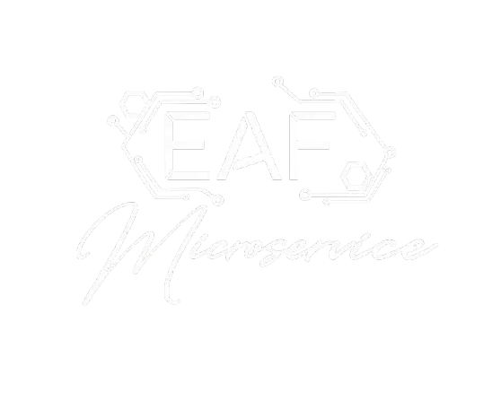

  

# EAF Microservice – Services Numériques pour PME

**EAF Microservice** est une entreprise de services numériques dédiée à l'accompagnement des petites et moyennes entreprises (PME) dans leur transformation digitale. Situés à Rabat (Agdal), Maroc, nous offrons des solutions informatiques sur mesure, accessibles et fiables pour booster votre compétitivité.

> _"Votre succès est notre technologie" 🚀_

---

## 🌟 À Propos

Nous sommes une équipe passionnée combinant expertise technique et vision business. Notre mission est de simplifier l'accès aux technologies professionnelles pour les PME en proposant des services de haute qualité et un accompagnement personnalisé.

## 💼 Nos Services

Nous offrons une gamme complète de services pour répondre à vos besoins digitaux :

### 🌐 Développement Digital

- **Sites Web & E-commerce** : Création de vitrines modernes et boutiques en ligne performantes.
- **Applications** : Développement d'applications mobiles (Android/iOS) et logiciels desktop.
- **Automatisation** : Scripts personnalisés pour gagner du temps et améliorer vos processus.

### 🔐 Maintenance & Sécurité

- **Cyber Sécurité** : Protection antivirus, formation aux bonnes pratiques.
- **Maintenance** : Gestion de parc informatique, mise à jour matériel et logiciel.
- **Configuration** : Gestion de serveurs et stratégies de groupe (GPO).

### 📊 Analyse de Données

- **Traitement de Données** : Analyse statistique (SPSS, AMOS, Excel).
- **Business Intelligence** : Tableaux de bord interactifs et rapports prédictifs.

### 📈 Formation & Stages

- Formations pratiques en développement, bureautique, algorithmique et gestion de projet.
- Mise à niveau des compétences employés.

### 🖥️ Saisie & Études

- Digitalisation de documents et saisie rapide.
- Études de marché et rapports personnalisés.

---

## 💎 Nos Valeurs

- **Accessibilité** : Des tarifs transparents adaptés aux budgets des PME.
- **Proximité** : Un interlocuteur dédié et un support réactif.
- **Innovation** : Des solutions modernes et évolutives.
- **Fiabilité** : Un service sécurisé et stable.

---

## 🛠️ Outils & Technologies

Nous utilisons les meilleures technologies pour garantir performance et fiabilité :

- **Développement** : Python (Django/Flask), Flutter (Dart), HTML/CSS/JS.
- **Données & BDD** : SQL, Firebase, MongoDB, PostgreSQL.
- **Outils** : Git, GitHub, Docker, VS Code, Android Studio.
- **Bureautique** : Microsoft Office, Power BI.
- **Systèmes** : Ubuntu, MacOS, Shell.

---

## 👥 L'Équipe

Une équipe engagée à vos côtés :

- **El Azbi Fouad** – Directeur Technique (Software Engineer & Concept)
- **Chouklah Youssef** – Directeur Commercial (Responsable Économique & Marketing)

---

## 📞 Contact

Vous avez un projet ? Discutons-en !

- **📍 Adresse** : Rabat, Agdal, Maroc
- **📱 Téléphone** : +212 645 994 904 / +212 727 593 647
- **📧 Email** : EAF.microservice@gmail.com
- **WhatsApp** : [Discuter sur WhatsApp](https://wa.me/212645994904)

### Suivez-nous

[Facebook](https://web.facebook.com/profile.php?id=61577782078660) | [LinkedIn](https://www.linkedin.com/in/eaf-microservice/) | [GitHub](https://github.com/eaf-microservice)

---

  © Copyright <strong>EAF Microservice</strong>. Tous droits réservés.

